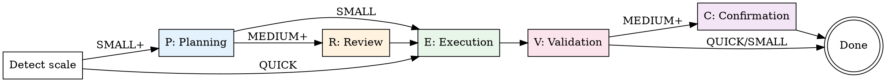

# PREVC Flow — Workflow Orchestrator

The main entry point for all development work. Routes tasks through the appropriate PREVC phases based on scale, enforcing gates between phases.

<HARD-GATE>
Do NOT skip phases. Do NOT advance past a gate without meeting its requirements. The scale determines which phases run, and gates determine when you can advance.
</HARD-GATE>

**Announce at start:** "I'm using the devflow:prevc-flow skill to orchestrate this workflow."

## Step 1: Detect Mode

Check the DevFlow mode from session context:
- **Full mode**: Use dotcontext MCP tools for workflow management
- **Lite mode**: Track phases manually, read `.context/` files directly
- **Minimal mode**: Fall back to linear superpowers flow (brainstorm → plan → execute)

## Step 1.5: Check for PRD

Before detecting scale, check if a PRD exists:

1. Search for `.context/plans/*-prd.md`
2. **If found:**
   a. Read the PRD file
   b. Find the first phase with status `⬚ Pending` or `⏳ In Progress`
   c. If no pending phases → announce "All PRD phases are complete!" and stop
   d. Use that phase's **Scope** as the task description
   e. Use that phase's **MoSCoW** to suggest scale:
      - Must Have → MEDIUM or LARGE
      - Should Have → SMALL or MEDIUM
      - Could Have → SMALL
   f. Mark the phase as `⏳ In Progress` in the PRD file
   g. Announce: "Starting PREVC for Phase N: <name> (from PRD)"
   h. Continue to Step 2 with the phase scope as task description
3. **If not found:**
   a. Continue current flow (no change)

**Tip:** If the user runs `/devflow <description>` and a PRD exists, check if the description matches a PRD phase. If it does, use the PRD phase context. If it doesn't, run as a standalone workflow (not all work needs to be in the PRD).

**`--from-prd` shortcut:** When the user runs `/devflow auto --from-prd` or `/devflow autonomy:X --from-prd`:
   - Skip brainstorming — use the PRD phase scope directly as the spec
   - In Step 4.5 of prevc-planning, use Path A (PRD→stories) instead of Path B
   - Planning phase generates stories.yaml directly from PRD without Socratic dialogue
   - This enables existing projects with a PRD to jump straight to autonomous execution

## Step 2: Determine Scale

Auto-detect from the task description, or accept explicit `scale:X`:

| Signal | Scale |
|--------|-------|
| "fix bug", "typo", "update config", "bump version" | QUICK |
| "add button", "simple endpoint", single-file change | SMALL |
| "add feature", "implement X", multi-file change | MEDIUM |
| "redesign", "migrate", "new system", "refactor architecture" | LARGE |

If ambiguous, ask the user: "This could be SMALL or MEDIUM. Which scale fits better?"

## Step 2.5: Determine Autonomy

Parse the `autonomy:X` parameter from the command, or default to `supervised`:

| Parameter | Mode | Behavior |
|-----------|------|----------|
| `autonomy:supervised` (default) | Supervised | Human approves each phase transition |
| `autonomy:assisted` | Assisted | Human in P+R, autonomous E, human in V+C |
| `autonomy:autonomous` | Autonomous | All phases run without human intervention |
| `auto` (alias) | Autonomous | Shorthand for `autonomy:autonomous` |

**Autonomy affects phase behavior:**

| Phase | supervised | assisted | autonomous |
|-------|-----------|----------|------------|
| **P** | Socratic brainstorming with human | Socratic brainstorming with human | Auto-generate spec + plan + stories.yaml |
| **R** | Human reviews | Human reviews | Agents review (escalate on BLOCK) |
| **E** | Sequential with checkpoints | Autonomous loop (stories.yaml) | Autonomous loop (stories.yaml) |
| **V** | Human reviews findings | Human reviews findings | Agent reviews (escalate on critical) |
| **C** | Human confirms PR | Human confirms PR | Auto-create PR with summary |

Pass the autonomy mode to each phase skill as context. Phase skills check the autonomy mode and adapt their behavior accordingly.

## Step 3: Initialize Workflow

### Full Mode
```
workflow-init({ name: "<task-slug>", scale: "<SCALE>", autonomous: <true if autonomy is autonomous> })
```

### Lite/Minimal Mode
Create a task list tracking phases:
```
Phase P (Planning)     — [ ] pending
Phase R (Review)       — [ ] pending (skip if QUICK/SMALL)
Phase E (Execution)    — [ ] pending
Phase V (Validation)   — [ ] pending
Phase C (Confirmation) — [ ] pending (skip if QUICK/SMALL)
```

## Step 4: Execute Phases

For each active phase, invoke the corresponding skill:

| Phase | Skill to invoke | Gate to advance |
|-------|----------------|-----------------|
| **P** | `devflow:prevc-planning` | Spec approved + plan written |
| **R** | `devflow:prevc-review` | Plan approved by reviewer(s) |
| **E** | `devflow:prevc-execution` | All tasks completed + tests pass |
| **V** | `devflow:prevc-validation` | All verifications pass |
| **C** | `devflow:prevc-confirmation` | Branch merged/ready + docs updated |

### Advancing Phases

**Full mode:**
```
workflow-advance()  # Checks gates automatically
```

**Lite/Minimal mode:**
Verify gate requirements manually, then update task list.

## Phase Flow



## Autonomy Upgrade/Downgrade Mid-Workflow

Users can change autonomy level during an active workflow without losing progress.

### Upgrade (e.g., supervised → autonomous)

Triggered by: `/devflow autonomy:autonomous` during an active workflow, or natural language like "switch to autonomous mode."

1. Check current workflow state (stories.yaml exists? which phase?)
2. **If stories.yaml already exists:** Update `stats.current_autonomy` field → resume with new mode
3. **If stories.yaml does NOT exist but plan exists:** Generate stories.yaml from existing plan (Path B of Step 4.5 in prevc-planning) → continue in E phase with new mode
4. **If no plan and no stories:** Cannot upgrade — announce "Run Planning first to generate a plan, then upgrade autonomy."
5. Update workflow metadata:
   - Full mode: `workflow-manage({ action: "setAutonomy", mode: "<new_mode>" })`
   - Lite mode: Edit `stories.yaml` → set `stats.current_autonomy: <new_mode>`
6. Announce: "Autonomy upgraded to <mode>. Resuming from current position."

### Downgrade (automatic or manual)

**Automatic:** Triggered by escalation rules (2 failures per story, 3 consecutive, security finding).
**Manual:** User says "switch to supervised" or `/devflow autonomy:supervised`.

1. Update `stats.current_autonomy` in stories.yaml
2. Pause autonomous execution
3. Present current state to human for review
4. Continue in new mode from current story

**Important:** Upgrade/downgrade preserves ALL progress — completed stories, attempt counts, and stats remain intact. Only the execution mode changes.

## Anti-Patterns

| Thought | Reality |
|---------|---------|
| "This is too simple for PREVC" | Use QUICK scale — it's just E→V. Still disciplined. |
| "I know what to build, skip Planning" | Planning catches assumptions. Even 2 minutes saves hours. |
| "Review is overkill for this" | Then it's SMALL scale. Don't skip R, use the right scale. |
| "Tests pass, skip Validation" | Validation includes security, performance, and edge cases. |
| "I'll document later" | Confirmation phase exists precisely because "later" never comes. |

## Context Enrichment

Before entering any phase, enrich context based on mode:

### Full Mode
```
context({ action: "buildSemantic" })  # Deep codebase understanding
agent({ action: "getPhaseDocs", phase: "X" })  # Phase-specific docs + agents
```

### Lite Mode
Read these files if they exist:
- `.context/docs/project-overview.md`
- `.context/docs/codebase-map.json`
- `.context/docs/development-workflow.md`

### Minimal Mode
- Check project files, docs, recent git commits (standard superpowers approach)

## Remember

- The orchestrator invokes phase skills — do NOT implement phase logic here
- Respect gates: no advancing without meeting requirements
- Scale can be adjusted mid-workflow if scope changes (with user approval)
- In Full mode, use `workflow-status()` to check current state at any time
- Autonomy mode is passed to phase skills as context — each skill adapts its behavior
- `autonomous` mode still respects all quality gates — it just doesn't ask the human
- If autonomy mode causes a phase to fail, the skill can downgrade to `assisted` automatically
