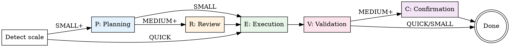

# PREVC Flow — Workflow Orchestrator

The main entry point for all development work. Routes tasks through the appropriate PREVC phases based on scale, enforcing gates between phases.

<HARD-GATE>
Do NOT skip phases. Do NOT advance past a gate without meeting its requirements. The scale determines which phases run, and gates determine when you can advance.
</HARD-GATE>

**Announce at start:** "I'm using the devflow:prevc-flow skill to orchestrate this workflow."

## Step 1: Detect Mode

Check the DevFlow mode from session context:
- **Full mode**: Use dotcontext MCP tools for workflow management
- **Lite mode**: Track phases manually, read `.context/` files directly
- **Minimal mode**: Fall back to linear superpowers flow (brainstorm → plan → execute)

## Step 2: Determine Scale

Auto-detect from the task description, or accept explicit `scale:X`:

| Signal | Scale |
|--------|-------|
| "fix bug", "typo", "update config", "bump version" | QUICK |
| "add button", "simple endpoint", single-file change | SMALL |
| "add feature", "implement X", multi-file change | MEDIUM |
| "redesign", "migrate", "new system", "refactor architecture" | LARGE |

If ambiguous, ask the user: "This could be SMALL or MEDIUM. Which scale fits better?"

## Step 3: Initialize Workflow

### Full Mode
```
workflow-init({ name: "<task-slug>", scale: "<SCALE>" })
```

### Lite/Minimal Mode
Create a task list tracking phases:
```
Phase P (Planning)     — [ ] pending
Phase R (Review)       — [ ] pending (skip if QUICK/SMALL)
Phase E (Execution)    — [ ] pending
Phase V (Validation)   — [ ] pending
Phase C (Confirmation) — [ ] pending (skip if QUICK/SMALL)
```

## Step 4: Execute Phases

For each active phase, invoke the corresponding skill:

| Phase | Skill to invoke | Gate to advance |
|-------|----------------|-----------------|
| **P** | `devflow:prevc-planning` | Spec approved + plan written |
| **R** | `devflow:prevc-review` | Plan approved by reviewer(s) |
| **E** | `devflow:prevc-execution` | All tasks completed + tests pass |
| **V** | `devflow:prevc-validation` | All verifications pass |
| **C** | `devflow:prevc-confirmation` | Branch merged/ready + docs updated |

### Advancing Phases

**Full mode:**
```
workflow-advance()  # Checks gates automatically
```

**Lite/Minimal mode:**
Verify gate requirements manually, then update task list.

## Phase Flow



## Anti-Patterns

| Thought | Reality |
|---------|---------|
| "This is too simple for PREVC" | Use QUICK scale — it's just E→V. Still disciplined. |
| "I know what to build, skip Planning" | Planning catches assumptions. Even 2 minutes saves hours. |
| "Review is overkill for this" | Then it's SMALL scale. Don't skip R, use the right scale. |
| "Tests pass, skip Validation" | Validation includes security, performance, and edge cases. |
| "I'll document later" | Confirmation phase exists precisely because "later" never comes. |

## Context Enrichment

Before entering any phase, enrich context based on mode:

### Full Mode
```
context({ action: "buildSemantic" })  # Deep codebase understanding
agent({ action: "getPhaseDocs", phase: "X" })  # Phase-specific docs + agents
```

### Lite Mode
Read these files if they exist:
- `.context/docs/project-overview.md`
- `.context/docs/codebase-map.json`
- `.context/docs/development-workflow.md`

### Minimal Mode
- Check project files, docs, recent git commits (standard superpowers approach)

## Remember

- The orchestrator invokes phase skills — do NOT implement phase logic here
- Respect gates: no advancing without meeting requirements
- Scale can be adjusted mid-workflow if scope changes (with user approval)
- In Full mode, use `workflow-status()` to check current state at any time
