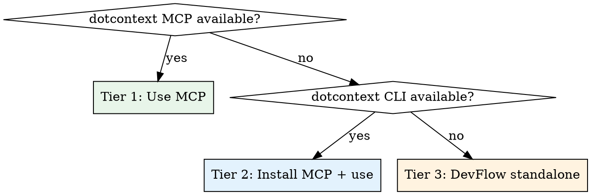

# Project Init

Initialize a project with `.context/` containing project-aware agents, skills, and documentation. Uses dotcontext when available for the richest output, falls back to DevFlow's own scaffolding when not.

<HARD-GATE>
Se `.context/docs/` já existe, este projeto já tem contexto — não é uma inicialização do zero.
Neste caso, **delegue para `devflow:context-sync`** que atualiza o conteúdo existente.

Fluxo:
1. Verificar se `.context/docs/` existe
2. **SIM** → Invocar skill `devflow:context-sync` (sync completo) e PARAR
3. **NÃO** → Prosseguir com inicialização normal (scaffold + fill)

Após o scaffold inicial (primeira execução), nunca sobrescrever arquivos com `status: filled`.
Apenas preencher arquivos MISSING ou com `status: unfilled`.
Para atualizar docs existentes, o usuário deve usar `/devflow:devflow-sync`.
</HARD-GATE>

**Announce at start:** "I'm using the devflow:project-init skill to initialize this project."

## Step 0: Language Selection (BLOQUEANTE — nada acontece antes disto)

<HARD-GATE>
A seleção de idioma é o PRIMEIRO passo absoluto da inicialização. Nenhum scaffold, instalação, ou scan pode acontecer antes do idioma estar definido. O idioma determina:
1. Em qual língua o dotcontext será instalado/configurado (`--lang`)
2. Em qual língua TODO o conteúdo gerado será escrito (docs, agents, skills)
3. Em qual língua TODAS as interações subsequentes acontecerão (mensagens, relatórios, perguntas)

Fluxo:
1. Verificar se `.devflow-language` (projeto) ou `~/.devflow-language` (global) existe
2. **SIM** → Usar o idioma existente, confirmar ao usuário, e PROSSEGUIR no idioma
3. **NÃO** → Mostrar menu de seleção, AGUARDAR escolha, salvar, e ENTÃO prosseguir
</HARD-GATE>

### Verificar preferência existente

```bash
# Check project-level
cat .devflow-language 2>/dev/null

# Check user-level
cat ~/.devflow-language 2>/dev/null
```

### Se NÃO existe preferência — mostrar menu interativo

Apresentar o menu via AskUserQuestion e AGUARDAR a resposta do usuário antes de qualquer próximo passo:

```
━━━━━━━━━━━━━━━━━━━━━━━━━━━━━━━━━━━━━━━━━━━━━━━━━
  DevFlow — Select your language / Selecione o idioma / Selecciona tu idioma
━━━━━━━━━━━━━━━━━━━━━━━━━━━━━━━━━━━━━━━━━━━━━━━━━

  1. 🇺🇸  English
  2. 🇧🇷  Português (Brasil)
  3. 🇪🇸  Español

━━━━━━━━━━━━━━━━━━━━━━━━━━━━━━━━━━━━━━━━━━━━━━━━━
```

Após a seleção, salvar imediatamente:
```bash
echo "<language-code>" > .devflow-language
```

### Propagação imediata do idioma ao dotcontext

Após definir o idioma, propagar para o dotcontext **ANTES de qualquer instalação ou uso do MCP**.

Se `.mcp.json` já existe com entry dotcontext, atualizar args com `--lang <locale>`:
- `en-US` → `--lang en`
- `pt-BR` → `--lang pt-BR`
- `es-ES` → `--lang es`

Se `.mcp.json` ainda não existe (será criado no Tier 2), a propagação acontece imediatamente após `dotcontext mcp:install` — veja Step 3b-1.

### Regra de idioma para todo o restante da inicialização

<EXTREMELY-IMPORTANT>
A partir deste ponto, TODAS as interações, conteúdo gerado, mensagens, relatórios, e perguntas DEVEM ser no idioma selecionado pelo usuário. Isso inclui:
- Conteúdo dos arquivos `.context/docs/` (project-overview, development-workflow, testing-strategy)
- Conteúdo dos arquivos `.context/agents/` (Mission, Responsibilities, Best Practices, etc.)
- Conteúdo dos arquivos `.context/skills/` (When to Use, Instructions, Examples, Guidelines)
- Mensagens de progresso e relatório final
- Qualquer pergunta feita ao usuário durante o processo
- Frontmatter `description` fields

Os ÚNICOS elementos que permanecem em inglês são:
- Nomes técnicos de campos YAML (type, name, status, scaffoldVersion)
- Nomes de arquivos e diretórios (.context/, agents/, skills/)
- Headings das seções de agents/skills (Mission, Responsibilities, etc.) — por compatibilidade dotcontext
- Nomes de ferramentas e comandos
</EXTREMELY-IMPORTANT>

Se preferência já existe, confirmar brevemente o idioma detectado e prosseguir.

## Step 0.5: Seleção de Runtime(s) (após o idioma)

```bash
node "${CLAUDE_PLUGIN_ROOT}/scripts/lib/detect-installed-runtimes.mjs"
```

Apresentar via AskUserQuestion **apenas os instalados** (claude/opencode/omp), multi-seleção, com o runtime corrente (via `omp/lib/detect-runtime.mjs`) pré-marcado. Gravar em `.context/.devflow.yaml`: `runtimes: [claude, omp]`. Ativar por runtime escolhido:
- `omp` → garantir o manifesto `omp.extensions` e rodar o enriquecimento de agentes omp no Step 4.6.
- `claude`/`opencode` → comportamento atual (nada extra).

## Initialization Strategy

DevFlow uses a **tiered approach** — always prefer the richest available tool:



### Tier 1: dotcontext MCP already available
MCP tools are ready — produces the richest content with semantic analysis and tree-sitter:
```
context({ action: "init" })            → scaffolds .context/ structure
context({ action: "fill" })            → fills with AI-powered analysis
context({ action: "buildSemantic" })   → deep codebase analysis (symbols, deps, patterns)
context({ action: "getMap" })          → generates codebase-map.json
context({ action: "detectPatterns" })  → identifies architecture patterns and conventions
```
After dotcontext fills and reinforces, DevFlow adds any missing files that dotcontext doesn't generate.

### Tier 2: dotcontext installable (CLI available)
Install dotcontext as MCP server (non-interactive), then use MCP tools.

**Step 1 — Ensure dotcontext CLI is available:**
```bash
# Check if already installed globally
dotcontext --version

# If not found, install globally (npx subcommands with ":" break on npm 11+)
npm install -g @dotcontext/cli
```

**Step 2 — Install MCP server:**
```bash
dotcontext mcp:install claude --local   → writes .mcp.json, no prompts
```
**Important:** Pass `claude --local` to skip the interactive tool selection prompt. This writes the MCP config to `.mcp.json` in the project root.

**Warning:** Do NOT use `npx dotcontext mcp:install` — npm 11+ misinterprets the `:` in `mcp:install` as an npm script separator. Always use the globally installed `dotcontext` binary for subcommands.

Once the MCP server is registered, it becomes available in the session. Then use the same MCP flow as Tier 1:
```
context({ action: "init" })    → scaffolds .context/ structure
context({ action: "fill" })    → fills with semantic analysis
```

**Note:** `init` and `fill` are MCP-only — they do NOT exist as CLI commands. The CLI is only used for `mcp:install`. Everything else goes through MCP tools.

Check availability: run `dotcontext --version` or `npx --yes @dotcontext/cli --version` via Bash. If either succeeds (exit 0), install and use MCP.
This upgrades the project from Minimal to **Full mode** permanently.

### Tier 3: DevFlow standalone (no dotcontext, no npx)
DevFlow scaffolds and fills `.context/` on its own by scanning the project:
- Reads actual files, directories, and patterns
- Generates project-aware content in dotcontext v2 format
- Result is compatible with dotcontext if installed later
- Enables **Lite mode**

## Compatibility Contract

Every file DevFlow generates in `.context/` MUST:
- Use dotcontext v2 frontmatter (`scaffoldVersion: "2.0.0"`)
- Use the exact field names dotcontext expects (`type`, `name`, `description`, `status`, `generated`)
- Use the exact section headings dotcontext expects (agents: 11 sections, skills: 4 sections)
- Set `status: filled` when DevFlow populates content, `status: unfilled` for scaffolds
- Be readable by `dotcontext` without errors

## Checklist

You MUST create a task for each of these items and complete them in order:

1. **Detect available tools** — check for dotcontext MCP, then CLI, then standalone
2. **Check existing state** — does `.context/` exist? which files are already filled?
3. **Run dotcontext** (Tier 1 or 2) OR **scan the project** (Tier 3)
4. **Fill gaps** — add any agents/skills/docs that dotcontext didn't generate
5. **Ensure skills README** — create `.context/skills/README.md` explaining plugin vs project skills (green-field clarity)
6. **Scaffold plans directory** — empty, ready for PREVC plans
6.5. **Scaffold knowledge layers** — create 4-layer tree; delegate initial fill to curators; surface migration path if legacy layout detected
7. **Verify compatibility** — all frontmatter matches dotcontext v2 format
8. **Configure MemPalace** — detect and optionally set up MemPalace integration (via devflow:config)
9. **Enable Lite/Full mode** — `.context/` now exists, DevFlow auto-detects

## Step 1: Detect Available Tools

Run these checks in order:

### Check 1: dotcontext MCP already running (Full mode)
If the session context shows `dotcontext MCP: true`, use Tier 1.

### Check 2: dotcontext CLI available
```bash
# Try global install first
dotcontext --version

# If not found, try via npx (note: only --version works via npx on npm 11+)
npx --yes @dotcontext/cli --version
```
If either succeeds (exit code 0), dotcontext can be installed as MCP. Use Tier 2.
If not globally installed, run `npm install -g @dotcontext/cli` first — `npx` cannot reliably run dotcontext subcommands on npm 11+.

### Check 3: Standalone
If neither MCP is running nor dotcontext CLI is available, use Tier 3.

## Step 2: Check Existing State

```
Check if .context/ exists
  ├─ YES: Read each file, check `status` field
  │   ├─ status: filled → SKIP (do not overwrite)
  │   ├─ status: unfilled → can be filled (by dotcontext or DevFlow)
  │   └─ file missing → can be created
  └─ NO: Proceed with initialization (Tier 1, 2, or 3)
```

## Step 3a: Tier 1 — dotcontext MCP

### 3a-1: Scaffold and fill
```
context({ action: "init" })
context({ action: "fill" })
```

### 3a-2: Reinforce with deep analysis
```
context({ action: "buildSemantic" })    → AST analysis, symbol extraction, dependency graph
context({ action: "getMap" })           → rich codebase-map.json with file descriptions
context({ action: "detectPatterns" })   → architecture patterns, conventions, code organization
```

These three calls reinforce `.context/` with data that `fill` alone doesn't capture:
- **buildSemantic** — tree-sitter AST parsing, class/function/type extraction, cross-file references
- **getMap** — machine-readable codebase structure with symbol counts and key exports
- **detectPatterns** — identifies MVC, service layer, repository pattern, etc.

Then proceed to Step 4 (fill gaps).

## Step 3b: Tier 2 — Install dotcontext MCP + use

### Step 3b-1: Install MCP server (non-interactive) + propagar idioma
```bash
# Ensure dotcontext is globally available (npx can't run subcommands with ":" on npm 11+)
command -v dotcontext >/dev/null || npm install -g @dotcontext/cli

# Install MCP config
dotcontext mcp:install claude --local
```
This writes `.mcp.json` to the project root with the dotcontext MCP server config. No interactive prompts. The MCP entry it adds:
```json
{
  "mcpServers": {
    "dotcontext": {
      "command": "npx",
      "args": ["-y", "@dotcontext/cli@latest", "mcp"]
    }
  }
}
```

**IMEDIATAMENTE após `mcp:install`**, propagar o idioma selecionado no Step 0 para o `.mcp.json` recém-criado. Usar o mesmo script Python do skill `devflow:language` para inserir `--lang <locale>` antes do subcomando `mcp` nos args:

```python
import json

mcp_path = ".mcp.json"
with open(mcp_path) as f:
    config = json.load(f)

if "dotcontext" in config.get("mcpServers", {}):
    args = config["mcpServers"]["dotcontext"]["args"]
    # Remove existing --lang/-l flags
    new_args = []
    skip_next = False
    for i, arg in enumerate(args):
        if skip_next:
            skip_next = False
            continue
        if arg in ("--lang", "-l"):
            skip_next = True
            continue
        new_args.append(arg)
    # Add --lang before "mcp" subcommand
    mcp_idx = new_args.index("mcp") if "mcp" in new_args else len(new_args)
    new_args.insert(mcp_idx, DOTCONTEXT_LOCALE)  # en, pt-BR, or es
    new_args.insert(mcp_idx, "--lang")
    config["mcpServers"]["dotcontext"]["args"] = new_args

    with open(mcp_path, "w") as f:
        json.dump(config, f, indent=2)
```

**Mapeamento de locales** (DevFlow → dotcontext):
- `en-US` → `en`
- `pt-BR` → `pt-BR`
- `es-ES` → `es`

Isso garante que o dotcontext MCP já inicia no idioma correto, e todo conteúdo gerado por `context({ action: "fill" })` será no idioma selecionado pelo usuário.

### Step 3b-2: Scaffold, fill, and reinforce via MCP
Once the MCP server is registered, use the same flow as Tier 1:
```
context({ action: "init" })            → scaffolds .context/ structure
context({ action: "fill" })            → fills with AI-powered analysis
context({ action: "buildSemantic" })   → deep codebase analysis
context({ action: "getMap" })          → generates codebase-map.json
context({ action: "detectPatterns" })  → identifies architecture patterns
```

**Note:** All of these are MCP-only operations — they do NOT exist as CLI commands. The CLI is only used for `mcp:install`.

**Important:** `fill` uses AI to populate docs/agents/skills. `buildSemantic` adds tree-sitter AST parsing, symbol extraction, and cross-file dependency analysis. `getMap` and `detectPatterns` further reinforce with structural and architectural context.

After completion, the project is now in **Full mode** — dotcontext MCP is available for all subsequent DevFlow operations.

Proceed to Step 4 (fill gaps).

## Step 3c: Tier 3 — DevFlow Standalone

No dotcontext available. DevFlow scans the project and generates `.context/` manually.
Follow Steps 3c-1 through 3c-4 below.

**Regra de idioma (Tier 3):** Como não há dotcontext para gerar conteúdo, o LLM é responsável por escrever TODO o conteúdo dos docs, agents, e skills no idioma selecionado no Step 0. Isso inclui descrições, instruções, exemplos, e qualquer texto livre nos arquivos gerados.

## Step 3c-1: Scan the Project (Tier 3 only)

Explore the codebase to determine:

### Project Type
- **CLI**: has `bin/` or `src/index.ts` with Commander/yargs
- **Web**: has `src/App.tsx` or `pages/` or `index.html`
- **API**: has `routes/` or `controllers/` or `server.ts`
- **Library**: has `src/lib/` or exports in `package.json`/`Cargo.toml`
- **Mobile**: has `ios/` or `android/` or React Native config
- **Monorepo**: has `packages/` or `apps/` or workspace config

### Stack Detection
Read `package.json`, `Cargo.toml`, `go.mod`, `requirements.txt`, `pyproject.toml`, etc.:
- Language(s)
- Framework(s)
- Database(s)
- Testing framework
- Build tools

### Framework Detection (perfis)
Run the framework detector to find architecture-specific agents/skills to add:
```bash
node "${CLAUDE_PLUGIN_ROOT}/scripts/lib/detect-framework.mjs" "$PWD"
```
It reads `profiles/*.yaml` (plugin) and returns JSON:
```json
{ "frameworks": ["odoo"], "agents": ["odoo-specialist"],
  "skills": ["odoo-development", "frontend-specialist-odoo"],
  "dispatchKeywords": { "odoo-specialist": ["odoo", "owl", "..."] } }
```
The returned `agents`/`skills` are **added** to the base scaffold sets in Step 3c-3 / 3c-4
(union, never replace). To support a new framework, add a sibling profile — no code change.

### Structure Mapping
Walk the directory tree (top 2-3 levels) and describe each directory's purpose.

### Pattern Detection
Look for:
- Architecture patterns (MVC, service layer, repository, etc.)
- Code conventions (naming, file organization)
- Testing patterns (where tests live, what framework)

## Step 3c-2: Scaffold Docs (Tier 3 only)

Create these files in `.context/docs/`:

### project-overview.md
```yaml
---
type: doc
name: project-overview
description: High-level overview of the project, its purpose, and key components
category: overview
generated: YYYY-MM-DD
status: filled
scaffoldVersion: "2.0.0"
---
```
Sections: Project Overview, Codebase Reference, Quick Facts, Entry Points, Key Exports, File Structure, Technology Stack Summary, Getting Started Checklist, Next Steps.

Fill each section with real data from the project scan.

### development-workflow.md
```yaml
---
type: doc
name: development-workflow
description: Development workflow, branching strategy, and coding conventions
category: workflow
generated: YYYY-MM-DD
status: filled
scaffoldVersion: "2.0.0"
---
```
Sections: Branch Strategy, Code Conventions, CI/CD Pipeline, Review Process.

### testing-strategy.md
```yaml
---
type: doc
name: testing-strategy
description: Testing approach, frameworks, and coverage expectations
category: testing
generated: YYYY-MM-DD
status: filled
scaffoldVersion: "2.0.0"
---
```
Sections: Test Framework, Test Structure, Coverage Expectations, Testing Patterns.

### codebase-map.json
```json
{
  "version": "2.0.0",
  "generated": "YYYY-MM-DD",
  "stack": { "languages": [], "frameworks": [], "databases": [], "tools": [] },
  "structure": { "directories": {} },
  "keyFiles": [],
  "stats": { "totalFiles": 0, "totalLines": 0 }
}
```

## Step 3c-3: Scaffold Agents (Tier 3 only)

Only scaffold agents relevant to the detected project type:

| Project Type | Agents to scaffold |
|-------------|-------------------|
| All | architect, product-manager, code-reviewer, test-writer, documentation-writer |
| Web/Mobile | + frontend-specialist |
| API/Web | + backend-specialist |
| Has DB | + database-specialist |
| Has CI/CD | + devops-specialist |
| Has security concerns | + security-auditor |
| Large codebase | + refactoring-specialist, performance-optimizer |
| Bug fix focus | + bug-fixer |

**Framework profiles (union):** add every agent in the detector's `agents` list
(Framework Detection above) to the set. E.g. an Odoo project also scaffolds
`odoo-specialist`. The bundled `agents/odoo-specialist.md` is a **generic template** —
when scaffolding it, fill the "Ambientes de Desenvolvimento" placeholders
(`<PATH_DO_AMBIENTE>`, `<NOME_DO_DB>`, `<PORTA>`, `<PATH_DE_DEPLOY>`) from the project
scan and/or by asking the user. NEVER copy another project's paths/DBs/ports.

Each agent file in `.context/agents/<name>.md`:

```yaml
---
type: agent
name: <agent-name>
description: <from definitions>
role: <developer|reviewer|specialist|architect>
generated: YYYY-MM-DD
status: filled
scaffoldVersion: "2.0.0"
---
```

**11 sections per agent** (dotcontext format):
1. Mission — tailored to this project
2. Responsibilities — specific to this project's needs
3. Best Practices — project-specific conventions
4. Key Project Resources — actual project docs and configs
5. Repository Starting Points — actual directories
6. Key Files — actual entry points and important files
7. Architecture Context — actual layers and patterns
8. Key Symbols for This Agent — actual classes/functions
9. Documentation Touchpoints — actual doc files
10. Collaboration Checklist — project-specific steps
11. Hand-off Notes — typical handoff context for this project

**Fill with real project data.** Read actual files, list actual paths, describe actual patterns.

## Step 3c-4: Scaffold Skills (Tier 3 only)

Scaffold skills relevant to the project:

| Always | Conditional |
|--------|------------|
| code-review | api-design (if API project) |
| test-generation | security-audit (if auth/data handling) |
| commit-message | documentation (if public API/library) |
| refactoring | feature-breakdown (if large project) |

**Framework profiles (union + copy):** add every skill in the detector's `skills`
list (Framework Detection above). These framework skills are **full directories**
shipped with the plugin (`skills/<slug>/`), not scaffolded prose — **copy** each one
into `.context/skills/<slug>/` so the framework agent's references resolve:
```bash
cp -r "${CLAUDE_PLUGIN_ROOT}/skills/<slug>" ".context/skills/<slug>"
```
E.g. an Odoo project copies `odoo-development` and `frontend-specialist-odoo`.
Do not overwrite a `.context/skills/<slug>/` that already exists with user edits.

Each skill file in `.context/skills/<slug>/SKILL.md`:

```yaml
---
type: skill
name: <Skill Title>
description: <description>
skillSlug: <slug>
phases: [R, V]
generated: YYYY-MM-DD
status: filled
scaffoldVersion: "2.0.0"
---
```

**4 sections per skill** (dotcontext format):
1. When to Use — project-specific triggers
2. Instructions — project-specific steps
3. Examples — real examples from this project
4. Guidelines — project-specific best practices

## Step 3c-5: Scaffold Profile Standards + Stacks (all tiers, when a profile matches)

The framework detector (`frameworkContributions`) returns `standards` (ids of
profile-scoped enforcement Standards), `standardsWithOrigin` (`[{id, framework}]` — the
profile each std belongs to) and `stacks` (versioned doc sources). Unlike the
~20 universal default Standards — which are **live-merged** from the plugin at lint-time
and never copied — profile Standards are **framework-conditional** and therefore
**copied into the project** (same model as profile agents/skills), so their linters run
under the project's own `machine/` sandbox.

**Profile Standards (copy):** with profile composition (e.g. an NXZ project matches BOTH
`odoo` and `nxz`), the same `standards` list mixes ids from different profile bundles.
Use **`standardsWithOrigin`** to resolve the correct source dir per id — never assume a
single `<framework>`:
```bash
mkdir -p .context/engineering/standards/machine
# detector.standardsWithOrigin = [{id, framework}, ...]
for entry in <detector.standardsWithOrigin>; do   # id + framework por entrada
  id="${entry.id}"; fw="${entry.framework}"
  cp "${CLAUDE_PLUGIN_ROOT}/assets/standards/profiles/${fw}/${id}.md" \
     ".context/engineering/standards/${id}.md"
  cp "${CLAUDE_PLUGIN_ROOT}/assets/standards/profiles/${fw}/machine/${id}.js" \
     ".context/engineering/standards/machine/${id}.js"
done
```
E.g. an NXZ project copies `std-odoo-naming-conventions` from `profiles/odoo/` and
`std-odoo-oca-separation` from `profiles/nxz/` — each from its own origin.

> **Scaffold inicial vs. atualização.** O `cp` acima é o scaffold do zero (projeto novo).
> Para **atualizar** skills/standards verbatim já presentes (re-scaffold/sync), NÃO use
> `cp` cego nem `status: filled → SKIP` para decidir — delegue ao sync provenance-aware
> (`scripts/lib/provenance-sync.mjs apply`, ver `devflow:context-sync`): ele distingue
> deploy intocado (atualiza) de edição local (preserva) por hash. Agents seguem o fluxo
> de fill (fora da lib).

**Never overwrite** a `.context/engineering/standards/<id>.md` that already exists with
user edits, and honor `.context/standards.local.yaml` `disable:` — skip disabled ids.

**Profile Stacks (seed manifest):** for every entry in the detector's `stacks` list, add
it to the project's stack manifest so `devflow stacks scrape` can index the official docs
into the docs-mcp-server global store (one key per series, `mcpIndexed: true`):
```bash
node "${CLAUDE_PLUGIN_ROOT}/scripts/devflow-stacks.mjs" add \
  --lib=<stack.lib> --version=<stack.version> \
  --discovery-hint=<stack.discoveryHints[0]> --project=<PWD>
```
E.g. an Odoo project seeds `odoo-12@12.0`, `odoo-17@17.0`, `odoo-18@18.0`. The actual
scrape is a follow-up the user runs (`/devflow:scrape-stack-batch`); init only declares
the wishlist.

**Default Stacks (live-load, NOT copied):** the ~22 universal default stacks shipped with
the plugin (`assets/stacks/`) are **live-loaded** via `loadStacksMerged` at index/filter
time — exactly like the ~20 default Standards, they are **never copied** into the project.
Init does NOT seed them. The SessionStart index (`context-index-cli`) and the
`devflow:stack-filter` skill surface only the defaults relevant to the **detected
framework** (by dependency match). To customize a default stack's narrative doc in the
project, run `devflow stacks eject <lib>` (copies `assets/stacks/<concern>/<lib>.md` into
`.context/engineering/stacks/`). Honor `.context/stacks.local.yaml` `disable:` to suppress
a default. The profile-stack seeding above (via `devflow stacks add`) remains unchanged —
it declares libs that are NOT in the defaults.

## Step 4: Fill Gaps

After dotcontext (Tier 1/2) or DevFlow standalone (Tier 3) has run, check for gaps.

dotcontext generates its standard set of agents and skills, but DevFlow may need additional ones. For each file that DevFlow needs but dotcontext didn't create:
- Check if it exists in `.context/agents/` or `.context/skills/`
- If missing: scaffold it in dotcontext v2 format and fill with project context
- If exists with `status: unfilled`: fill it with project context

## Step 4.5: Skills Directory README (all tiers, mandatory)

Regardless of tier, **always** ensure `.context/skills/` exists with a README that explains the distinction between plugin skills (auto-loaded) and project skills (this directory).

This is critical for green-field projects where the directory may end up empty — without this README, the user sees an empty/missing directory and assumes init failed, when in reality dozens of plugin skills are already available via the DevFlow plugin install.

```bash
mkdir -p .context/skills
```

If `.context/skills/README.md` does NOT already exist, create it with content in the user's selected language. Template (pt-BR — adapt headings/text for en-US/es-ES):

```markdown
# Skills do projeto

Este diretório é para **skills específicos deste projeto** — fluxos repetitivos
ou convenções únicas do seu stack que não fazem sentido em outros lugares
(ex.: `deploy-staging`, `rodar-suite-e2e`, `migrar-dados-legacy`).

## Skills genéricos já estão disponíveis

Skills genéricos do DevFlow (`adr-builder`, `prevc-flow`, `code-review`,
`test-generation`, `commit-message`, etc.) **NÃO precisam ser copiados aqui**
— eles vêm com o plugin e são lidos direto da instalação.

Para listar todos os skills disponíveis no plugin:
- `/devflow help` — referência completa
- Skills aparecem com prefixo `devflow:` (ex.: `devflow:adr-builder`)

## Como criar um skill novo

Use `/devflow skill-creation` para gerar um skill seguindo o padrão DevFlow.
Skills criados aqui ficam locais ao projeto e são auto-carregados pelo Claude
quando você abre uma sessão neste diretório.
```

If a README already exists with `status: filled` or non-empty content, **do not overwrite** — preserve user customizations.

## Step 4.6: Enriquecimento omp dos agentes (só se `omp` ∈ runtimes)

Se `.context/.devflow.yaml` lista `omp`, enriquecer os agentes gerados —
**patch aditivo no frontmatter, nunca toca o corpo filled** (HARD-GATE):

```bash
node "${CLAUDE_PLUGIN_ROOT}/scripts/lib/omp-enrich-project-agents.mjs" "$PWD"
```

Apresentar os defaults propostos por agente (de `omp/omp-roles.yaml`) e permitir ajuste antes de confirmar.

## Step 5: Scaffold Plans Directory

```
mkdir -p .context/plans/
```

Plans are created during PREVC workflows, not during init.

### Git Strategy Configuration

After scaffolding `.context/`, check if `.context/.devflow.yaml` exists:

1. **If NOT exists** → Invoke `devflow:config` skill to run the interactive interview
2. **If exists** → Skip (preserve existing configuration)

The config skill interview includes git strategy (P1-P5), MemPalace integration (P6-P8, conditional on MCP availability), **docs-mcp-server** integration (P9, conditional on availability), and **doc-grounding** (P10, opt-in — força fatos de stack externo a virem só do MCP de docs, bloqueia web e fail-closed). All handled in a single interview flow.

This ensures every project initialized with DevFlow has a git strategy configured, plus optional opt-in for semantic memory (MemPalace), stack documentation indexing (docs-mcp-server), and doc-grounding enforcement.

**docs-mcp-server note:** when the user opts in, the config skill writes the MCP entry to `.mcp.json`. The new server requires a **Claude Code restart** to register — the skill must surface this explicitly so the user knows the `mcp__docs-mcp-server__*` tools won't be available in the current session.

## Step 5.5: Scaffold Knowledge Layers

After scaffolding plans, scaffold the 4-layer knowledge tree that curator agents maintain. These directories are **DevFlow-native** — they sit outside the dotcontext-managed directories (`docs/`, `agents/`, `skills/`, `plans/`) and are never touched, moved, or relocated by dotcontext.

<HARD-GATE>
Dotcontext-managed directories (`docs/`, `agents/`, `skills/`, `plans/`) are NEVER moved or reorganized by this step. Only additive layers and DevFlow-native subsystems are created here. Violating this corrupts dotcontext compatibility.
</HARD-GATE>

### Create the 4-layer knowledge tree

```bash
mkdir -p .context/business
mkdir -p .context/product
mkdir -p .context/operations
mkdir -p .context/engineering
```

Each directory receives a minimal `README.md` placeholder (in the user's selected language) explaining which curator owns it and what it contains. Use `status: unfilled` — the curators will fill them.

| Directory | Curator agent | Owns |
|---|---|---|
| `.context/business/` | `business-context` | vision, ICP, metrics |
| `.context/product/` | `product-context` | vision, persona, tone-of-voice, policies |
| `.context/operations/` | `operations-context` | runbooks, on-call, SLOs, infra |
| `.context/engineering/` | `engineering-context` | architecture, standards, subsystems |

**Standards default:** o DevFlow já disponibiliza ~20 standards default de engenharia (warn-only, concern-first) via plugin — não precisam ser scaffoldados. Eles aparecem no índice do SessionStart e são filtrados por `applyTo`/task. Para customizar um, use `/devflow standards eject <id>` (copia para `.context/engineering/standards/`, editável, com linter opcional em `machine/`).

### Engineering subsystems relocation (migration guard)

If a **legacy `.context/` layout (v1)** is detected — identified by subsystem directories sitting directly under `.context/` instead of under `.context/engineering/` (e.g., `.context/standards/`, `.context/architecture/`, `.context/subsystems/`) — do NOT relocate them manually. Instead, surface the migration path:

> "Legacy .context/ layout detected. Subsystem directories (`standards/`, `architecture/`, etc.) should live under `.context/engineering/`. Run `devflow:migration` to relocate them safely without breaking existing references."

Do not attempt the move inline — `devflow:migration` handles rewriting all cross-references.

### Delegate initial knowledge filling to curators

After creating the directories, delegate initial content filling via `devflow:knowledge`:

Invoke each curator agent in sequence. Each agent uses the `devflow:knowledge` skill (CLI: `node scripts/devflow-knowledge.mjs new --type=<id> --name=<name> --project=<path>`) to scaffold its layer docs:

- `business-context` agent — scaffolds `.context/business/` docs
- `product-context` agent — scaffolds `.context/product/` docs
- `operations-context` agent — scaffolds `.context/operations/` docs
- `engineering-context` agent — scaffolds `.context/engineering/` docs

Each curator will scaffold its own files with `status: unfilled` if no source context is available, or attempt to fill from existing project signals (README, package.json, existing docs, git history).

**Fallback (Lite/Minimal mode):** If `devflow:knowledge` is not available, create bare README.md files in each directory with `status: unfilled` and a note that the user should run `/devflow:knowledge` to populate them.

### Add knowledge layers to checklist output

When reporting (Step 7), include:
```markdown
### Knowledge Layers
- .context/business/   — [scaffolded | filled by business-context]
- .context/product/    — [scaffolded | filled by product-context]
- .context/operations/ — [scaffolded | filled by operations-context]
- .context/engineering/— [scaffolded | filled by engineering-context]
```

## Step 6: Verify Compatibility

After scaffolding, verify:
- [ ] Every file has valid YAML frontmatter
- [ ] `scaffoldVersion` is `"2.0.0"` everywhere
- [ ] `status` is `filled` or `unfilled` (never missing)
- [ ] Agent files have all 11 section headings
- [ ] Skill files have all 4 section headings
- [ ] Doc files follow their type's section structure
- [ ] `codebase-map.json` is valid JSON

## Step 7: Report

Present a summary:

```markdown
## Project Init Complete

**Tier used:** [1: MCP | 2: CLI | 3: Standalone]
**Mode:** [Full | Lite] (now active)
**Project type:** [detected type, or "green-field" if no code yet]
**Stack:** [languages, frameworks, or "(not detected — empty project)"]

### Generated by dotcontext
- [list of files dotcontext created/filled, if Tier 1 or 2]

### Generated by DevFlow (gap fill)
- [list of files DevFlow added on top]

### Skipped (already existed with status: filled)
- [list of files not overwritten]

### Skills available

**Plugin skills** (auto-loaded from DevFlow plugin, no copy needed):
- N skills com prefixo `devflow:*` disponíveis (adr-builder, prevc-flow, code-review, test-generation, commit-message, refactoring, security-audit, etc.)
- Veja `/devflow help` para a lista completa

**Project skills** (`.context/skills/`):
- [N project-specific skills scaffolded] OR
- [empty — diretório criado com README explicando como adicionar skills do projeto]

### Next steps
- Run `/devflow <task>` to start your first PREVC workflow
- [If green-field] Comece a escrever código primeiro; rode `/devflow:devflow-sync` depois para enriquecer agents e skills com contexto real
- [If Tier 3] Install dotcontext (`npm i -g @dotcontext/cli && dotcontext mcp:install claude --local`) for Full mode
```

**Critical for green-field projects:** Always include the "Skills available" section explicitly — users seeing an empty `.context/skills/` directory after init will think the tool failed. The report must make clear that plugin skills are available without copying.

## Anti-Patterns

| Pattern | Problem |
|---------|---------|
| Overwriting dotcontext-generated files | dotcontext fills with richer content (semantic, tree-sitter) |
| Generic agent playbooks | The whole point is project-specific content. Read real files. |
| Skipping project scan | Scaffolds without context are useless — they're just templates |
| Wrong frontmatter format | Breaks dotcontext compatibility. Always use v2 format. |
| Scaffolding agents that don't apply | A CLI tool doesn't need mobile-specialist |
